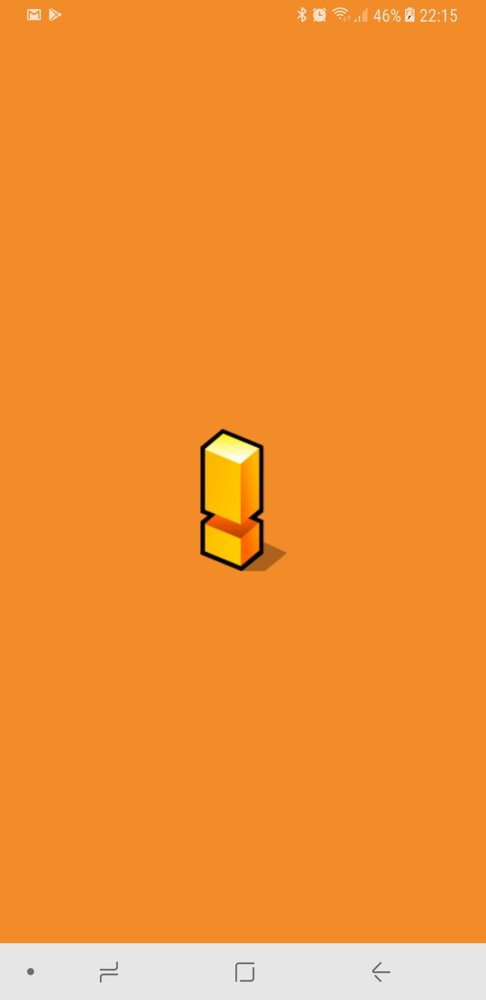

# GasStationWarning
FIAP - Trabalho Android 14mob

  
  
  
  

> A ideia foi criar um app para verificar informações referente 
a postos de combustiveis, preço da gasolina, ver se tem gasolina, onde fica, detalhe, telefone, adicionar comentarios...

## Tecnologias utilizadas
- Kotlin
- Android Architecture Components
  - Lifecycle
  - LiveData
  - ViewModel
- KODEIN KOtlin DEpendency INjectio
- Firebase
  - Firestore
  - Authentication
    - Facebook
    - Anonymous
  - Crashlytics
- Facebook

## Login

Possivel realizar o login utilizando o `facebook` ou como `anonimo`

## Home - Lista de Postos

Lista todos os postos cadastrados no `firestore` e ordenando 
por posto que possuem combustivel

## Posto - Detalhe

  
  

Algumas informações sobre o posto como nome, endereço, telefone, descrição, link.
Possibilita compartilhamento das informações

## Posto - Mapa

  

Mapa com a localização do posto

## Posto - Comentarios

  
  

Lista de comentarios realizado por usuarios.
Possibilita exclusão do comentario feito.

## Home - Sobre

Exibe informações sobre o desenvolvedor, versão do app e da a possibilidade de deslogar

## License

    Copyright 2018 Lucas Caramelo, Inc.
