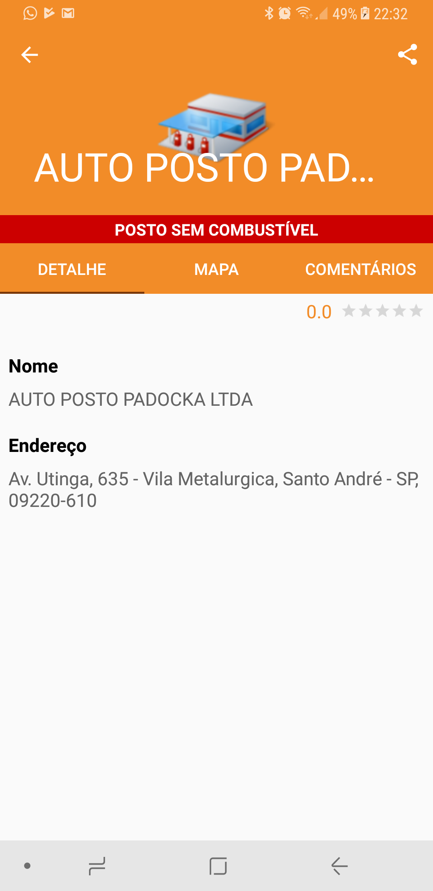

# GasStationWarning
FIAP - Trabalho Android 14mob

  
  
  
  

> Dificuldades para abastecer? Ou encontrar a melhor economia para o seu carro? Esse App foi desenvolvido para facilitar a buscar por postos de combustíveis, com a melhor localização. Além, de informar a melhor economia para o seu bolso. Com a possibilidade de comentários e avaliações. Economize na hora de abastecer e na hora de procurar o melhor posto para o seu carro. 

## Tecnologias utilizadas
- Kotlin
- Android Architecture Components
  - Lifecycle
  - LiveData
  - ViewModel
- KODEIN KOtlin DEpendency INjection
- Firebase
  - Firestore
  - Authentication
    - Facebook
    - Anonymous
  - Crashlytics
- Facebook

## Login

Possível realizar o login utilizando o `facebook` ou como `anônimo`

## Home - Lista de Postos

Lista de todos os postos cadastrados no `firestore` e ordenando 
por posto que possuem combustível.

## Posto - Detalhe

  
  

Algumas informações sobre o posto como; nome, endereço, telefone, descrição, link.
Possibilita compartilhamento das informações.

## Posto - Mapa

  

Mapa com a localização dos postos.

## Posto - Comentarios

  
  

Lista de comentários realizado por usuarios. Para deletar o seu comentário, basta pressionar e excluir.

## Home - Sobre

Exibe informações sobre o desenvolvedor, versão do app e da a possibilidade de deslogar.

## License

    Copyright 2018 Lucas Caramelo, Inc.
